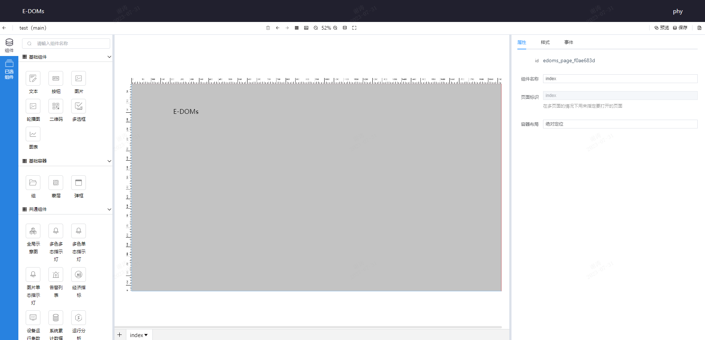
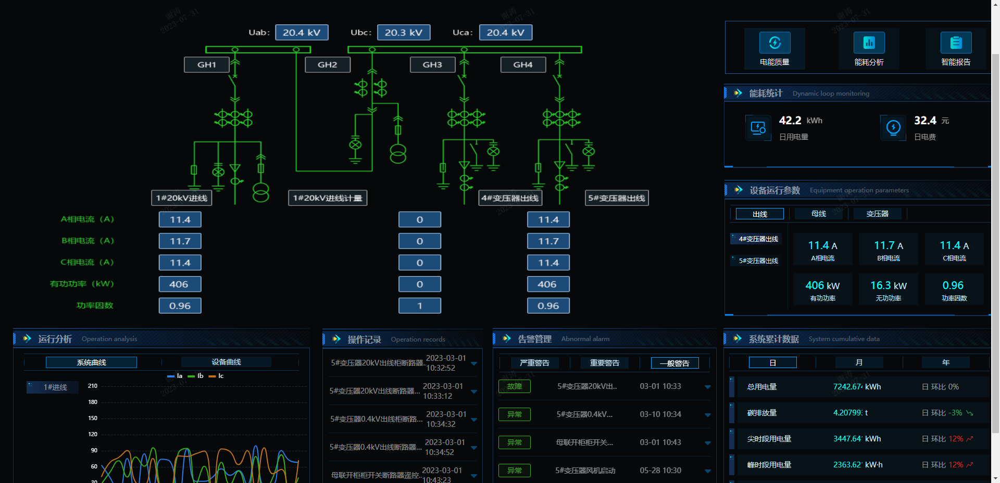
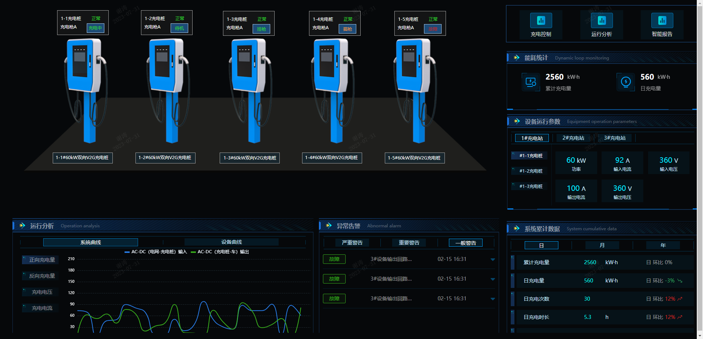
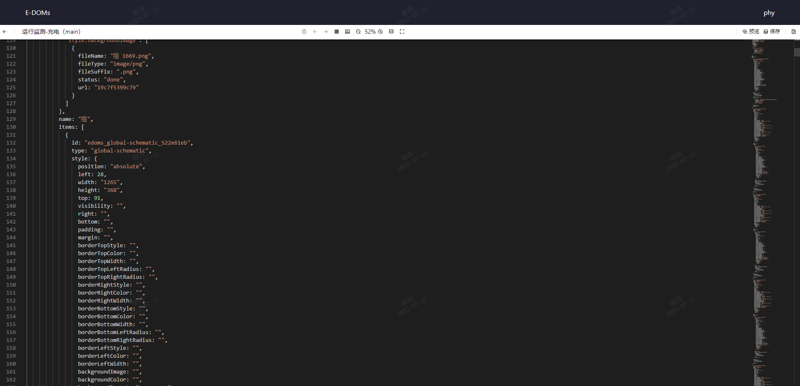
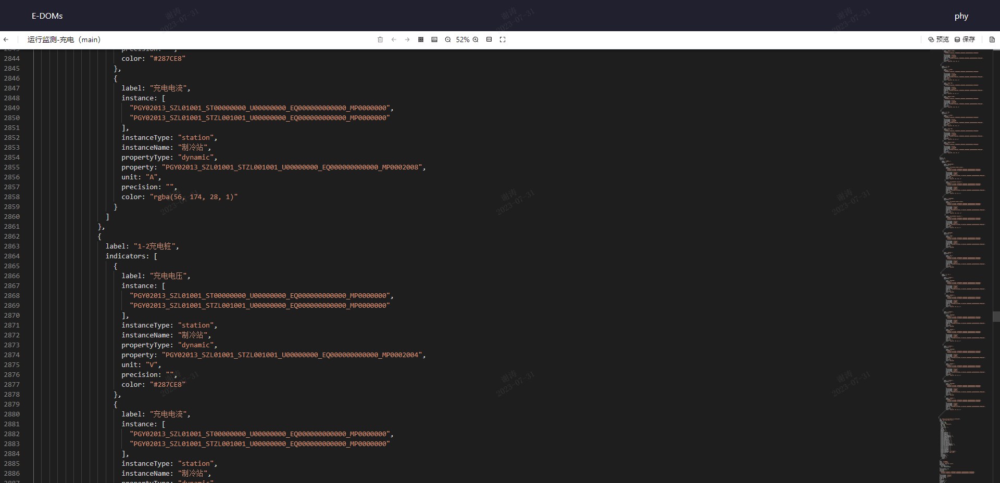

E-DOMs是一个低代码开发平台,是一种需要少量编码工作的平台，它通过视觉化拖放工具、预定义的
模块和组件、自动生成的代码和其他辅助功能来帮助用户简化应用程序的开发过程。在低代码平台上
，开发人员需要编写少量的代码来完成一些特定的功能，例如添加自定义的业务逻辑、调整视图等。  

* **编辑界面**: 支持缩放、前进、后退、全屏、等编辑器功能满足用户的编辑需求。  
  
* **预定义组件**: 提供各种预定义的组件、模块和插件，用户可以通过拖拽这些组件来快速构建
应用程序，例如数据表格、表单、电子大屏等。  
  

* **自动生成的代码**：用户不需要手动编写代码，低代码平台可以自动生成代码，从而减少了编
程的工作量。  

* **数据集成**: >>>  

* **服务部署**: >>>  

相信你对E-DOMs已经有了初步的认识,接下来我们将会对组件的使用方式以及属性配置流程做 相关
介绍。[点此继续→](./basiccomponents/text.md)