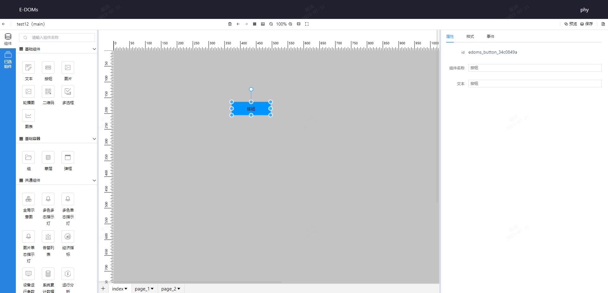
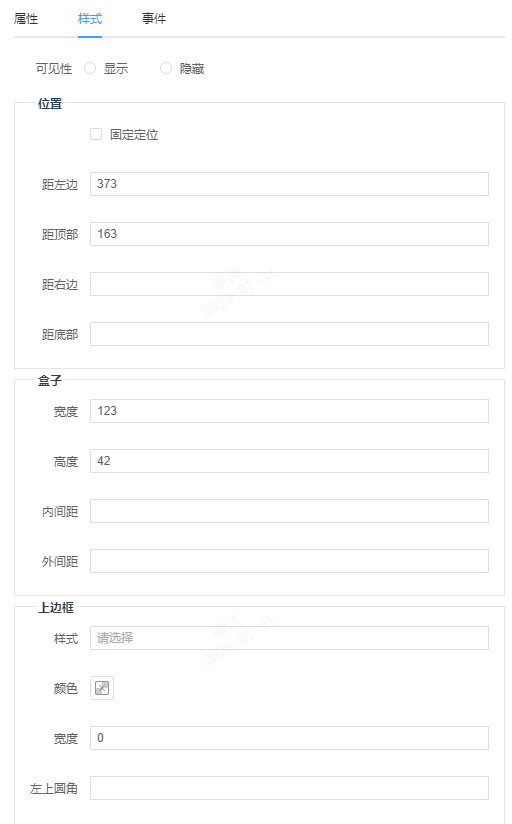
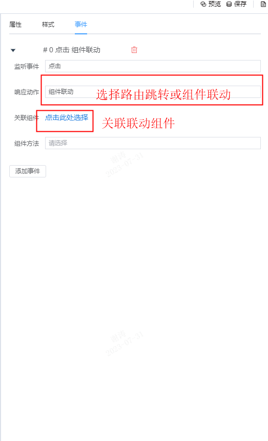

# 按钮
* **作用及使用场景**: 按钮是前端交互的重要元素之一。它可以用于触发各种事件，如提交表
单、弹出对话框、播放视频等。  
* **配置项**: 编辑器右侧,修改文本配置项内容已更改按钮名称,可以通过样式tab栏切换,更改
按钮宽高、背景、字体颜色等样式。  
1. 属性: 
   - 组件名称
   - 文本: 更改可修改按钮名称
2. 样式: 可根据不同需求修改样式,适配不同的业务需求
3. 事件: 添加点击事件,选择目标组件设置组件间的联动效果
* **示例**: 

