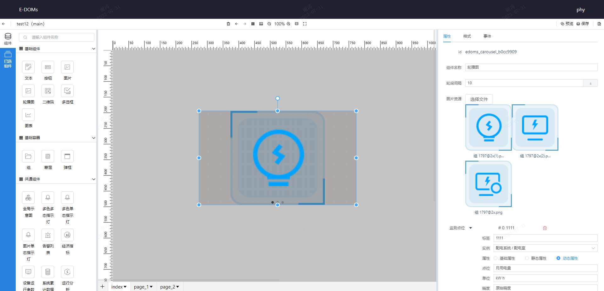

# 轮播图
* **配置项**:  
    1. 组件名称
    2. 轮询间隔: 设置数据请求间隔时间,默认10s。
    3. 图片资源: 轮播图片资源,点击选择本地图片上传,支持同时选择多张图片或者单张图片依次上
    传。
    4.  监测点位: 数据来源
        - 标签: 数据的名称
        - 实例: 数据挂载的实例
        - 属性: 数据的类型
        - 点位: 该实例下具体点位
        - 单位: 数据的单位
        - 精度: 小数点位数
* **示例**:    
