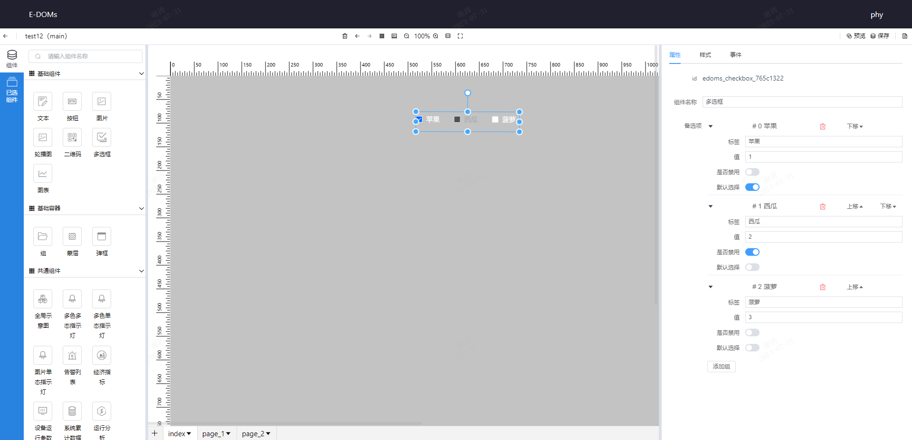

# 多选框
* **配置项**:  
    1. 属性
        - 组件名称
        - 备选项: 添加多选框数据
            - 标签: 多选框名称
            - 值: 对应的值
        是否禁用: 是否禁止使用
        默认选择: 默认是否选中
    2. 样式: 通过调整样式更改多选框的位置,大小等。
* **示例**:     
